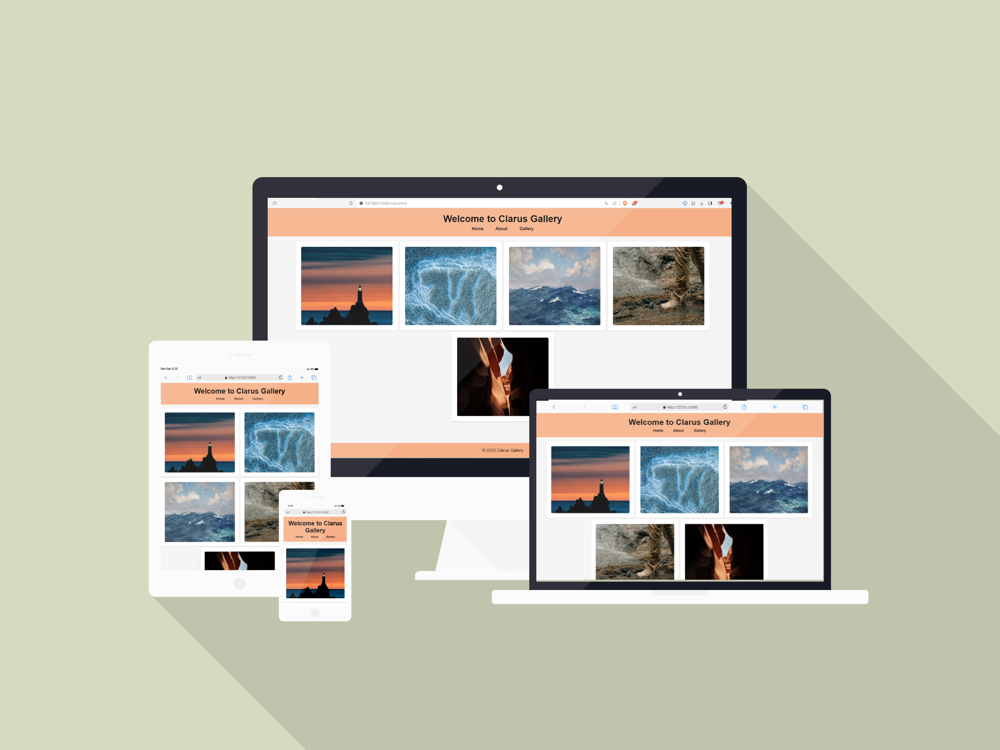

## Project Title: Clarus Gallery HTML/CSS Design

### Description:

The Clarus Gallery project is an example of a website designed for users to explore various art collections and exhibitions. The primary goal of this project is to reinforce CSS features such as 'flex' ,'position', 'margin', and 'padding' while creating an attractive, user-friendly, and responsive web interface.

### Expected Outcome:

` `

### Demo

[**Clarus Gallery**](https://anthonyins.github.io/ass-flex/)

### Note

- Please remember to customize the images and texts according to your preferences.
