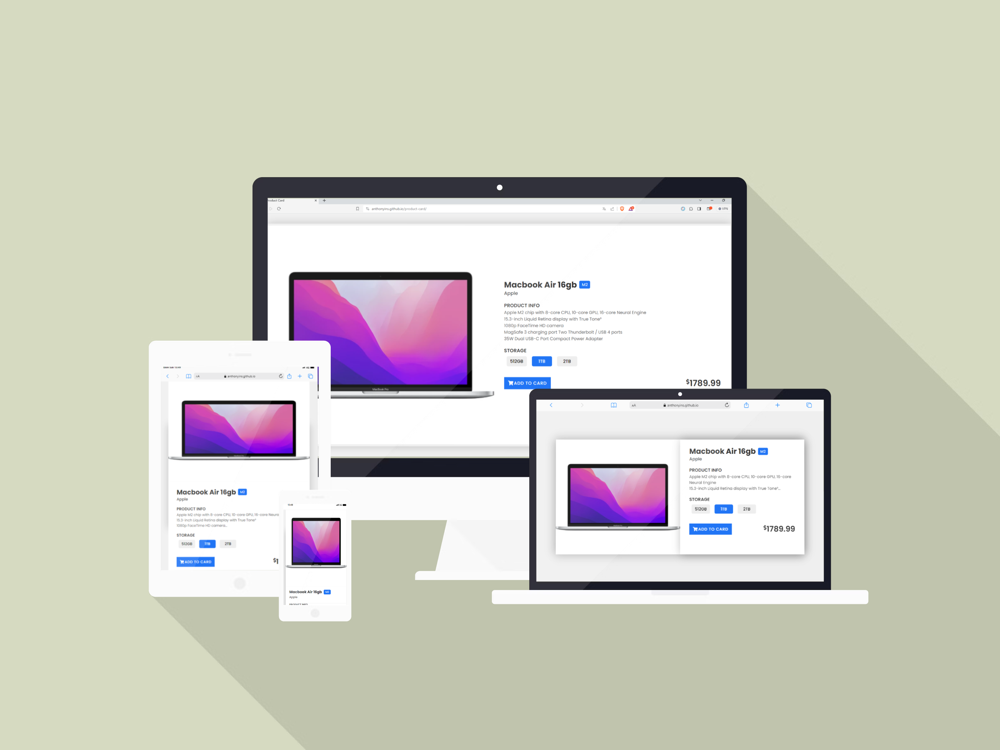
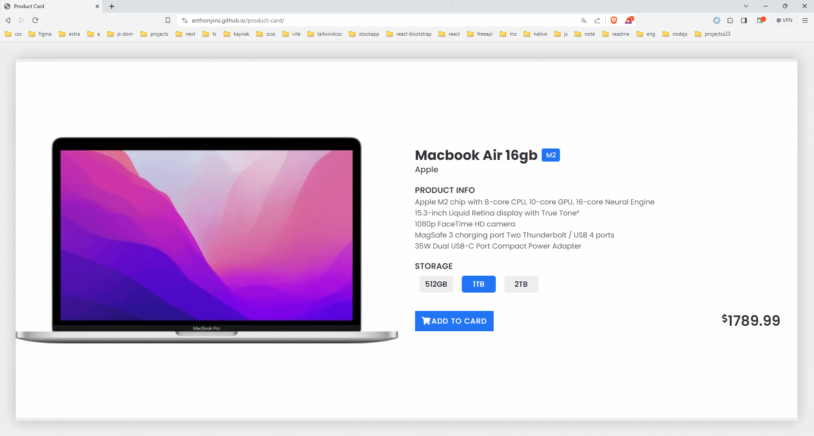

## Project Title: Responsive Product Card HTML/CSS Design

### Description:

The Responsive Product Card project is a demonstration of an attractive and user-friendly web design for showcasing product details. This project focuses on enhancing CSS skills, including 'media queries", 'flex',  'margin', and 'padding' to create a responsive product card interface.

### Expected Outcome:

 

### Demo

[Responsive Product Card](https://anthonyins.github.io/product-card/)

### Note

- Please remember to customize the images and texts according to your preferences.
- The line-clamp property truncates text at a specific number of lines. If you want to see how it's used, [click here](https://benmarshall.me/modern-css/#line-clamp).